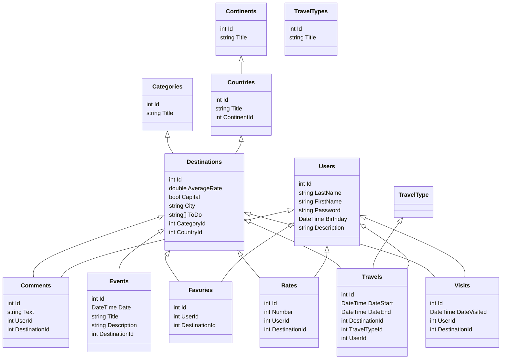

# Travel Agency

Application réalisé par Anael Lasserre et Florent Detres.

___
## Backend

Le backend est donc en csharp, nous avons fait la totalité des objectifs que vous nous avez donné ainsi que des suppléments afin de simuler un vrai projet d'agence de voyage.

Pour ce qui est des bonus : 
* Multi-filtrage : 
    * La méthode "GetAllDestinationByUserAndCategory" dans Destination, on obtient les destinations en fonction des voyages qu'un utilisateur a fait dans une certaine catégorie.

* Stockage de la date de naissance dans le DTO :
    * Nous n'avons pas trouvé, (Anaël) personnellement je n'ai pas compris comment stocker la date de naissance dans le dto est possible, si le server back-end redémarre on est obligé de perdre les dates de naissance, non ?

### Modèle de données :

## Angular

Pour ce qui est de l'angular, nous n'avons pu faire que la page d'accueil afin d'afficher les catégories et les destinations.

Pour manipuler le back-end, utiliser l'interface swagger reste nécessaire.

## VS Code

Le projet a été réalisé via VS Code et non via VS. Si vous souhaitez l'utiliser avec vscode, voici les commandes à exécuter depuis la racine du projet :
* Pour lancer le back-end :
    > dotnet run --project LasserreDetresTravelAgency

* Pour lancer angular :
    > cd front-travel-agency
    >
    > ng serve

Je recommande l'utilisation de VS Code car le port utiliser par le back-end en Csharp change en fonction de l'IDE, pour VS Code le port utilisé est 7094 alors que pour VS le port utilisé est différent d'après ce que j'ai vu. Angular ne fonctionnera pas avec un port différent de 7094 à moins qu'on change manuellement dans angular.